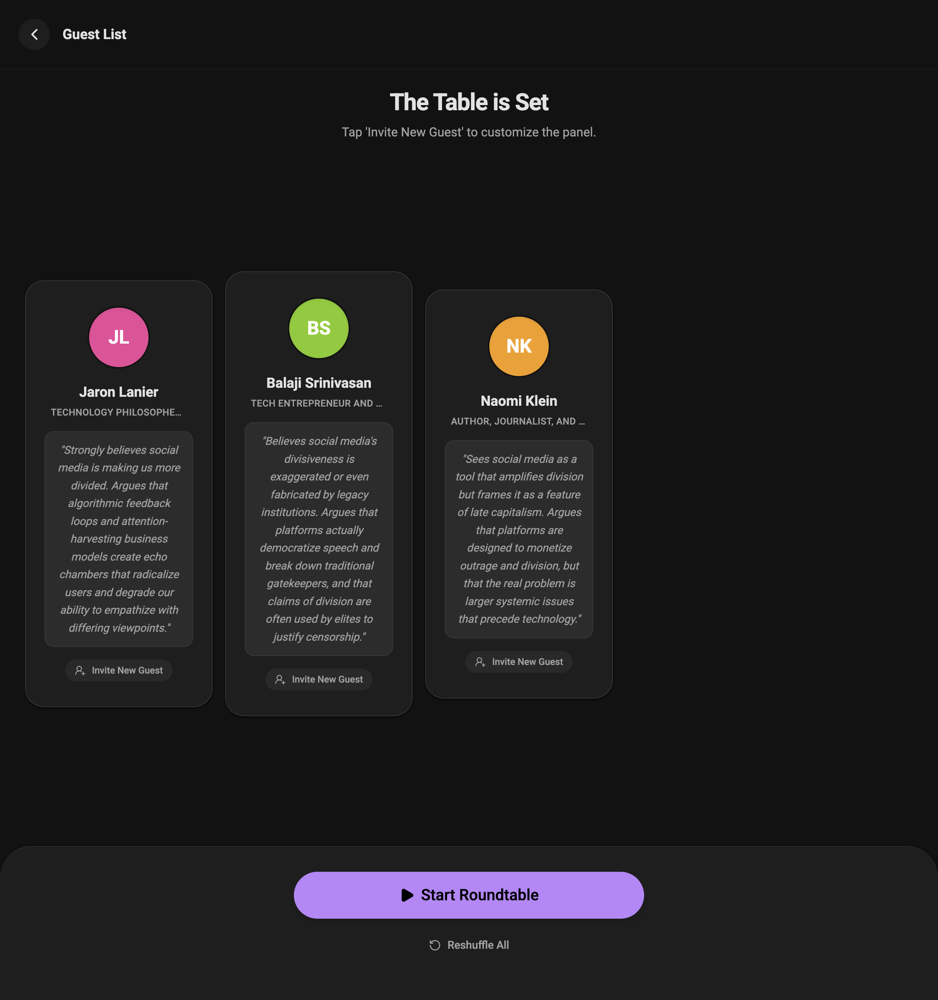

# The Roundtable (圆桌)

**The Roundtable** is a MiniMax M2 AI-powered intellectual discussion platform. It simulates an elite salon where you act as the host, engaging with AI-simulated guests for deep intellectual exchange.

## Screenshots

**Panel**



**Discussion**


---

## Core Workflow

### 1. Login
Sign in with Google, GitHub, or email/password. The first registered user automatically becomes admin.

### 2. Onboarding
Set your nickname, identity, and preferred language. The AI tailors its tone and depth accordingly.

### 3. Topic Selection
Enter a custom topic or generate a random one. Random topics are drawn from **20 diverse domains** — politics, philosophy, ethics, economics, education, environment, culture, art, sports, and more.

### 4. Panel Building
AI picks 3 real people with contrasting perspectives. Customize via "precision swap":
- **Specific name** (e.g. "Taylor Swift") — AI identifies the person and builds a plausible stance
- **General description** (e.g. "a skeptical economist") — AI matches the best real person
- Concurrent swaps supported without interference

### 5. Opening Statements
Each guest delivers a sub-50-word opening statement. Every speech includes a vivid **action description** (e.g. *"She leans forward, hands clasped on the table, her gaze steady and warm"*) displayed as cinematic stage directions.

### 6. Discussion Loop
Core mechanisms:
- **Speaker prediction**: AI analyzes context (@mentions, host cues, opposing views)
- **Depth vs. breadth**: Converge (drill into logic) and diverge (pivot perspective) alternate
- **Authentic character voices**: Entertainers use emotional intuition, scientists use analytical precision, activists bring fire and urgency
- **Action descriptions**: Every turn includes a cinematic stage direction
- **Stance metadata**: 12 stances (AGREE, DISAGREE, SURPRISED, INTRIGUED, CHALLENGED, CONCEDE, BUILD_ON, CLARIFY, QUESTION, etc.) with 1–5 intensity
- **12% random speaker override**: Occasionally picks an unexpected speaker for unpredictability

### 7. Summary
AI generates a detailed JSON report:
- 5–8 sentence narrative covering the full discussion arc
- Core viewpoints for every guest **plus the host** (4 key points + memorable quote each)
- 3+ key discussion turning points
- 3+ unresolved open questions with explanations
- Synthesis conclusion

### 8. History
All discussions are automatically saved to SQLite. Browse past discussions, view full transcripts, and continue any discussion from where it left off. Admin can access all users' discussions.

### 9. Admin Panel
User management (CRUD), admin/superuser controls, and full visibility into all platform discussions. Admins can ghost into any user's discussion to continue on their behalf.

---

## Tech Stack

| Layer | Technology |
|---|---|
| Frontend | React 19, TypeScript 5.8, Vite 6 |
| Backend | Python FastAPI, aiosqlite, PyJWT, bcrypt, authlib |
| Database | SQLite (users, discussions, messages) |
| Auth | JWT (HS256, 7-day expiry), Google OAuth, GitHub OAuth, email/password |
| AI | MiniMax M2 via Anthropic-compatible API |
| UI | Material Design 3 dark theme, Lucide icons |

---

## Getting Started

### Prerequisites
- Node.js 18+
- Python 3.11+
- MiniMax API key

### Environment Setup

Configure `backend/.env`:
```
ANTHROPIC_API_KEY=sk-cp-***
ANTHROPIC_BASE_URL=https://api.minimaxi.com/anthropic/v1
ALLOWED_ORIGINS=http://localhost:3000
JWT_SECRET=<random-32-char-string>
```

Optionally configure OAuth in `backend/.env`:
```
GOOGLE_CLIENT_ID=xxx.apps.googleusercontent.com
GOOGLE_CLIENT_SECRET=GOCSPX-xxx
GITHUB_CLIENT_ID=xxx
GITHUB_CLIENT_SECRET=xxx
```

### Development

```bash
npm install
cd backend && source venv/bin/activate && pip install -r requirements.txt

# Start backend (port 3001)
PYTHONPATH=. backend/venv/bin/python -m uvicorn backend.main:app --reload --port 3001 --host 0.0.0.0

# Start frontend (port 3000)
npm run dev

# Run tests
cd backend && python -m pytest test_auth.py test_discussions.py -v

# Production build
npm run build
```

### Interaction Tips
- Use `@GuestName` to force the next speaker
- AI yields back to the host after several rounds
- Replace guests by name or description on the panel review screen
- Click the summarize button anytime during discussion
- View past discussions from the landing page

---

## API Endpoints

### Auth (`/api/auth/*`)
| Method | Path | Auth |
|--------|------|------|
| POST | `/register` | No |
| POST | `/login` | No |
| POST | `/google` | No |
| POST | `/github` | No |
| GET | `/me` | JWT |
| PUT | `/me` | JWT |

### Admin (`/api/auth/admin/*`)
| Method | Path | Auth |
|--------|------|------|
| GET | `/users` | Admin |
| POST | `/users` | Admin |
| PUT | `/users/{id}` | Admin |
| DELETE | `/users/{id}` | Admin |

### Discussions (`/api/discussions/*`)
| Method | Path | Auth |
|--------|------|------|
| POST | `/` | JWT |
| GET | `/` | JWT |
| GET | `/{id}` | JWT |
| POST | `/{id}/messages` | JWT |
| PUT | `/{id}` | JWT |
| DELETE | `/{id}` | JWT |

### Admin Discussions (`/api/admin/discussions/*`)
| Method | Path | Auth |
|--------|------|------|
| GET | `/` | Admin |
| GET | `/{id}` | Admin |
| POST | `/{id}/messages` | Admin |
| PUT | `/{id}` | Admin |
| DELETE | `/{id}` | Admin |

### AI Generation (`/api/*`)
| Method | Path | Auth |
|--------|------|------|
| POST | `/generate_random_topic` | JWT |
| POST | `/generate_panel` | JWT |
| POST | `/generate_single_participant` | JWT |
| POST | `/predict_next_speaker` | JWT |
| POST | `/generate_turn` | JWT |
| POST | `/generate_summary` | JWT |
